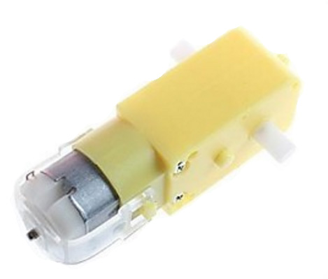

# Initial page

## Цели:

1. Сделать радио управляемую машину
2. Сделать корпус защищённый от разрушения ребёнком от 1 года.
3. Корпус должен не иметь острых углов

## Компоненты:

1. Мотор колёса:
2. Драйвер для моторов, H-bridge L9110S: 
3. Кнопка питания: 
4. приёмник 6 каналов: 
5. Сенсорная кнопка: 
6. ардуино нано: 
7. Аккумулятор lipo 2s 30c 2200 mAH: 
8. Пассивное колесо: 

