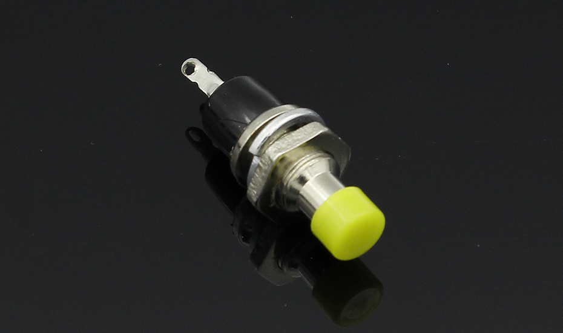
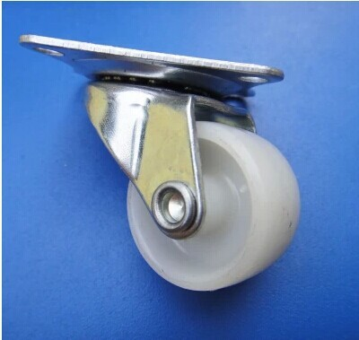

# Initial page

## Задачи:

1. Сделать радио управляемую машину
2. Сделать корпус защищённый от разрушения ребёнком от 1 года.
3. Корпус должен не иметь острых углов

## Компоненты:

1. [Мотор колёса](https://russian.alibaba.com/product-detail/mini-5v-dc-gear-motor-for-electric-toys-tronsun-motor-t-130-60356151712.html): [интересная страничка](https://3d-diy.ru/wiki/arduino-moduli/drajver-dvigatelya-l9110s/)
2. [Драйвер для моторов, H-bridge L9110S](https://www.terraelectronica.ru/product/2091066): 
3. [Кнопка питания](https://aliexpress.ru/item/32806585772.html?spm=a2g0s.9042311.0.0.264d33edvZchHq): 
4. [приёмник 6 каналов](https://fccid.io/N4ZFLYSKYIA6B/User-Manual/User-Manual-2578917): 
5. [Сенсорная кнопка](https://aliexpress.ru/item/32798630944.html?spm=a2g0s.9042311.0.0.264d33edvZchHq): 
6. Arduino Nano 
   1. [Описание](https://arduinomaster.ru/platy-arduino/plata-arduino-nano/)
   2. [схема](https://www.arduino.cc/en/uploads/Main/Arduino_Nano-Rev3.2-SCH.pdf)
   3.   
   4.  
7. [Аккумулятор lipo 2s 30c 2200 mAH](https://systop.ru/rc-model/26-vse-pro-lipo-akkumulyatory-zaryadka-ekspluataciya-hranenie.html): 
8. [Пассивное колесо](https://aliexpress.ru/item/4000284053351.html?spm=a2g0o.productlist.0.0.261e37dbv0Flnx&algo_pvid=f7bfd35a-6827-484c-afd5-3bf700ec3b84&algo_expid=f7bfd35a-6827-484c-afd5-3bf700ec3b84-16&btsid=0b8b036315863901697093215e72bf&ws_ab_test=searchweb0_0,searchweb201602_,searchweb201603_): 
9. [Понижающий DC-DC преобразователь](https://3d-diy.ru/product/ponizhayushhij-dc-dc-preobrazovatel-lm2596?gclid=CjwKCAjw7LX0BRBiEiwA__gNw2KR6lpraJ9YqIhZg96d8xAmmyZsg3aVhUp-Kdx0nNspOJkhPeGh2hoCUvMQAvD_BwE):  

## Полезные статьи:

1. [Подключение мотора к драйверу и к ардуине](https://3d-diy.ru/wiki/arduino-moduli/drajver-dvigatelya-l9110s/)
2. [Обработка PWM сигналов от приёмника](https://eax.me/pwm-ppm-decoding/)

